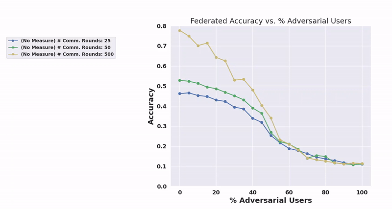

## Table of Contents
- [TLDR](#TLDR)
- [The Rise of Federated Learning](#the-nature-of-internal-threats)
  - [Fundamental Concepts at Its Core](#fundamental-concepts-at-its-core)
  - [Challenges and Vulnerabilities](#challenges-and-vulnerabilities)
  - [The Nature of Internal Threats](#the-nature-of-internal-threats)
  - [Privacy vs. Security Trade-off](#privacy-vs-security-trade-off)
- [Genesis of TrustShield](#genesis-of-trustshield)
  - [TrustShield Mechanics](#trustshield-mechanics)
  - [Blockchain Technology in FL](#blockchain-technology-in-fl)
  - [Understanding ZKPs](#understanding-zkps)
  - [Balancing Act](#balancing-act)
  - [Empirical Evaluation of TrustShield](#empirical-evaluation-of-trustshield)
- [Unveiling the Toolbox](#unveiling-the-toolbox)
  - [Potential Applications](#potential-applications)
  - [Impact on the FL Landscape](#impact-on-the-fl-landscape)
- [Conclusion](#Conclusion)

## TLDR
🚀 Welcome to TrustShield: Fortify Your Federated Learning!

TrustShield is your shield against adversarial storms in the world of Federated Learning. This open-source powerhouse introduces a cutting-edge defense mechanism against Label Flipping (LF) attacks. By harnessing the power of blockchain-backed validators, TrustShield ensures that your FL models remain unscathed and resilient, even in the face of malicious users. Say goodbye to vulnerabilities; TrustShield guarantees secure and robust FL training processes.

### 🛡 Why TrustShield?

#### Robust Security:
TrustShield empowers FL systems with a decentralized network of validators, certifying non-poisonous gradients for clean aggregation.
Advanced Defense: Battle-tested against LF attacks, TrustShield outshines vanilla FL and even surpasses state-of-the-art mechanisms.
Real-World Impact: Boost your medical ML projects and NLP applications with TrustShield’s resilience, ensuring privacy without compromising performance.

### 🌟 Key Features:
#### Trustworthy Validation:
Validators on a blockchain infrastructure ensure non-poisonous gradients, fortifying your FL models.
#### Performance Boost:
Witness significant accuracy improvements across datasets and communication rounds, even in challenging scenarios.
#### Efficient Detection:
TrustShield's OoD detection functionality enhances model performance, steering your FL systems to greater accuracy.

## The Rise of Federated Learning
Federated Learning (FL) has emerged as a groundbreaking approach in the field of machine learning, enabling collaborative model training while maintaining data privacy. This paradigm shift allows multiple participants, such as smartphones or organizations, to contribute to the development of a shared model without transferring their data to a central server. This method not only addresses privacy concerns but also reduces bandwidth requirements, making machine learning more accessible and efficient. As the digital world continues to expand, FL is becoming increasingly relevant, providing a solution to the ever-growing need for data security and decentralized processing in various applications ranging from healthcare to finance.
#### Fundamental Concepts at Its Core
Federated Learning involves training algorithms across multiple decentralized devices or servers holding local data samples, without exchanging them. This process typically involves a central server that coordinates the algorithm updates from all participants. Each participant trains a model on their data and sends only the model updates to the server. The server then aggregates these updates to improve the global model. This approach ensures that the sensitive data never leaves its original location, thereby preserving privacy and security. Understanding these basic principles is crucial for grasping how FL transforms the traditional machine learning landscape.
#### Challenges and Vulnerabilities 
Despite its advantages, FL faces significant challenges, particularly in security and data integrity. One of the primary concerns is the susceptibility of the system to malicious actors who might alter data or model updates, leading to compromised model performance. Additionally, the decentralized nature of FL makes it difficult to ensure the quality and reliability of the data being used, as it cannot be directly inspected due to privacy preservation. These vulnerabilities necessitate the development of robust mechanisms to safeguard the FL process against potential attacks and data breaches.
#### The Nature of Internal Threats 
Internal threats in Federated Learning, such as label-flipping attacks, pose a significant risk. In these attacks, malicious participants intentionally modify labels in their training data, leading to incorrect model updates. When aggregated, these corrupted updates can drastically degrade the performance of the global model. Understanding the mechanics and potential impacts of such attacks is crucial for developing effective countermeasures. These threats highlight the importance of not only securing the data but also ensuring the integrity of the learning process itself.
#### Privacy vs. Security Trade-off
A critical challenge in Federated Learning is balancing privacy with security. While the primary goal of FL is to protect user data privacy, this often limits the ability to thoroughly inspect and validate data and model updates. This privacy-preserving nature of FL can inadvertently create blind spots, making it more susceptible to attacks from malicious participants. Addressing this trade-off requires innovative solutions that can reinforce security without compromising the privacy of the participant's data.
## Genesis of TrustShield 
The conception of TrustShield arose from the need to address the aforementioned challenges in FL. TrustShield introduces an innovative framework that integrates blockchain validators into the FL process, aiming to enhance security and data integrity. This integration represents a novel approach in the intersection of blockchain technology and machine learning, aiming to leverage the immutable and transparent nature of blockchain to safeguard the FL process against internal threats and data breaches.

#### TrustShield Mechanics 
TrustShield operates by incorporating blockchain validators in the FL process. These validators are responsible for verifying the integrity of the data updates submitted by each participating node. Whenever a node submits an update, the validators review the update for signs of tampering or malicious activity. The use of blockchain ensures that the process is transparent and tamper-proof, as each validation step is recorded on the blockchain. This mechanism enhances the overall security of the FL system, mitigating the risks posed by internal threats.
#### Blockchain Technology in FL 
The integration of blockchain technology in Federated Learning, as exemplified by TrustShield, brings a new dimension of security and trustworthiness to FL systems. Blockchain's inherent characteristics, such as decentralization, immutability, and transparency, make it an ideal tool for validating and securing data transactions in FL. By leveraging blockchain, TrustShield creates a secure and trustworthy environment for participants to collaborate in training machine learning models, ensuring that the data integrity and model updates are maintained throughout the process.
#### Understanding ZKPs 
Zero-knowledge proofs (ZKPs) are a cryptographic method that allows one party to prove to another that a statement is true, without revealing any information beyond the validity of the statement itself. In the context of TrustShield, ZKPs play a pivotal role in maintaining data privacy while allowing for the validation of data updates. This technology ensures that while the integrity of the data is verified, the actual content remains confidential, striking a balance between security and privacy in the FL process.
#### Balancing Act 
The implementation of Zero-Knowledge Proofs in TrustShield is a critical balancing act between data privacy and security. ZKPs enable the system to verify the authenticity and integrity of data updates from participants without exposing the underlying data. This approach addresses the privacy vs. security trade-off in FL by providing a means to maintain strict data confidentiality while ensuring that the data used in the learning process is reliable and has not been tampered with.
#### Empirical Evaluation of TrustShield 
The empirical evaluation of TrustShield involved extensive testing on various datasets, including MNIST, CIFAR-10, Chest X-ray images, and a Natural Language Processing dataset. These tests were designed to assess the effectiveness of TrustShield in real-world scenarios, evaluating its resilience to common attacks in FL, particularly label-flipping. The results demonstrated a significant improvement in the robustness of the FL models when protected by TrustShield, indicating its potential as a viable solution for securing FL systems.

The analysis of the results from the empirical evaluation revealed that TrustShield effectively mitigates the risks posed by malicious participants in FL. The study showed that even with a substantial proportion of adversarial nodes, the models protected by TrustShield maintained high accuracy and robustness. These findings underscore the efficacy of integrating blockchain validators and Zero-Knowledge Proofs in enhancing the security and reliability of FL systems.

In a comparative study, TrustShield's performance was benchmarked against traditional FL systems under similar conditions. This comparison highlighted TrustShield's superior ability to withstand adversarial attacks, showcasing its resilience in maintaining model accuracy and integrity. The study provided compelling evidence of the advantages of incorporating blockchain technology and cryptographic techniques in FL, setting a new standard for secure federated learning.

## Unveiling the Toolbox
Accompanying the research paper is an open-source toolbox designed to facilitate the implementation and analysis of TrustShield in various FL environments. This toolbox serves as a valuable resource for researchers and practitioners, offering a suite of tools and algorithms for deploying TrustShield, conducting experiments, and analyzing the results. The availability of this toolbox marks a significant contribution to the FL community, enabling further exploration and development in the field.

#### Potential Applications
The potential applications of the TrustShield toolbox are vast and varied. It can be utilized in scenarios where data privacy and security are of utmost importance, such as in healthcare, finance, and telecommunications. For instance, hospitals collaborating on medical research can use TrustShield to securely train models on sensitive patient data. Similarly, financial institutions can leverage it to develop fraud detection models without compromising client confidentiality. The toolbox opens up new possibilities for secure collaboration in data-sensitive domains.
#### Impact on the FL Landscape 

The introduction of TrustShield is poised to have a profound impact on the landscape of Federated Learning. By addressing the critical challenges of security and privacy, TrustShield paves the way for more widespread adoption and trust in FL systems. Its innovative approach sets a new benchmark for secure and private collaborative learning, potentially transforming how organizations and individuals engage in machine learning projects.

Looking ahead, the development of TrustShield heralds new directions in the convergence of blockchain technology and machine learning. Future research may explore further enhancements to TrustShield, such as optimizing the efficiency of blockchain validators or integrating more advanced cryptographic techniques. Additionally, the applicability of TrustShield in other areas of distributed computing presents an exciting avenue for exploration, promising advancements in both the security and functionality of decentralized systems.

To aid in understanding TrustShield, visualizations such as flowcharts and diagrams are used to illustrate its working mechanism. Case studies, depicting real-world scenarios where TrustShield can be applied, provide practical insights into its functionality and benefits. These visual aids and examples help in demystifying the complex interactions between blockchain validators, FL nodes, and Zero-Knowledge Proofs, making the concepts more accessible and relatable to a broader audience.

TrustShield's application extends to a variety of real-world scenarios where secure and private data processing is crucial. For instance, in collaborative drug discovery, pharmaceutical companies can use TrustShield to securely share insights without exposing proprietary data. In smart city projects, it can ensure the privacy and integrity of data collected from various sensors and devices. These scenarios highlight TrustShield's versatility and potential to revolutionize data collaboration across different industries.
## Conclusion
In conclusion, "TrustShield: Resilient Federated Learning with Blockchain Validators" represents a significant advancement in the field of machine learning and blockchain technology. By effectively addressing the key challenges of security and privacy in Federated Learning, TrustShield opens new horizons for secure, decentralized data processing. Its innovative approach not only enhances the robustness of FL systems but also fosters a more trustworthy and collaborative environment for machine learning endeavors.
